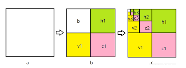

## Signal Processing on Image

Here I will show some of signal process method(or computer vision method) and its result.\
The code may need pretrained model to analysis the noise part of adversarial examples.
:::warning
**Goal** : To analysis the pattern of adversarial example.
:::

### Discrete wavelet transform
A discrete wavelet transform(DWT) is a transform that decompose a given signal into a number of sets, where each set is a time series of coefficients describing the time evolution of the signal in the corresponding frequency band. For 2D-image, we hope that we can get a wavelet filter and use it to  process image by convolution or matrix multiplication. There is a wide-use package can help us do so.

\begin{split}

\end{split}

After doing so, we can get four subbands, whose width and height are half of original image. They describe the high frequency、low-frequency and mid-frequency, respectively. For my goal, I hope to decompose the pattern that I found in the adversarial perturbation in low-frequency, which can found some pattern to defense or detect.

\begin{split}

\end{split}
