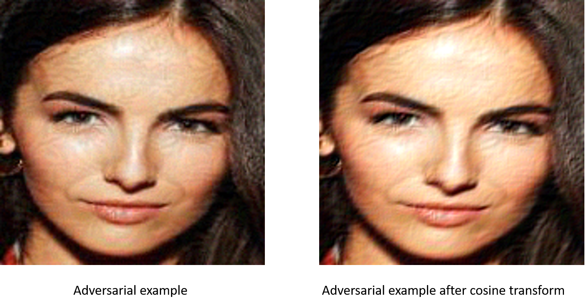
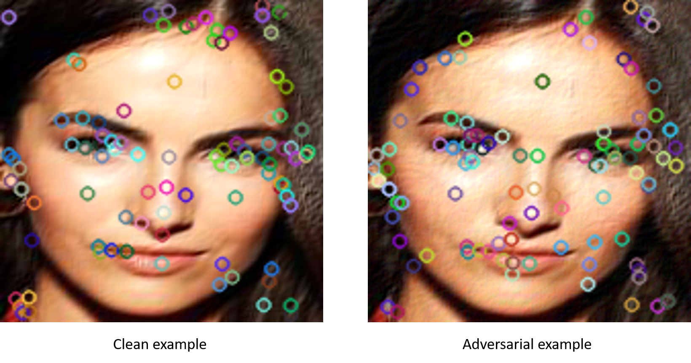

## Signal Processing on Image

Here I will show some of signal process method(or computer vision method) and its result.\
The code may need pretrained model to analysis the noise part of adversarial examples.
:::warning
**Goal** : To analysis the pattern of adversarial example.
:::

### Discrete wavelet transform
A discrete wavelet transform(DWT) is a transform that decompose a given signal into a number of sets, where each set is a time series of coefficients describing the time evolution of the signal in the corresponding frequency band. For 2D-image, we hope that we can get a wavelet filter and use it to  process image by convolution or matrix multiplication. There is a wide-use package can help us do so.

After doing so, we can get four subbands, whose width and height are half of original image. They describe the high frequency、low-frequency and mid-frequency, respectively. For my goal, I hope to decompose the pattern that I found in the adversarial perturbation in low-frequency, which can found some pattern to defense or detect.

### Discrete cosine transform
A discrete cosine transform (DCT) is defined and an algorithm to compute it using the fast Fourier transform is developed. It is shown that the discrete cosine transform can be used in the area of digital processing for the purposes of pattern recognition and Wiener filtering.

The image above is a transformed image using discrete cosine transform and the kernel size is 3x3.

### Scale-invariant feature transform (SIFT)
SIFT stands for Scale-Invariant Feature Transform and was first presented in 2004, by D.Lowe, University of British Columbia. SIFT is invariance to image scale and rotation. This algorithm is patented, so this algorithm is included in the Non-free module in OpenCV.\

The algorithm
SIFT is quite an involved algorithm. There are mainly four steps involved in the SIFT algorithm. We will see them one-by-one.

* **Scale-space peak selection**: Potential location for finding features.
* **Keypoint Localization**: Accurately locating the feature keypoints.
Orientation Assignment: Assigning orientation to keypoints.
* **Keypoint descriptor**: Describing the keypoints as a high dimensional vector.
* **Keypoint Matching**

There are some different feature between clean example and adversarial example, its because the adversarial noise is also thought as robust feature that may affect the prediction.